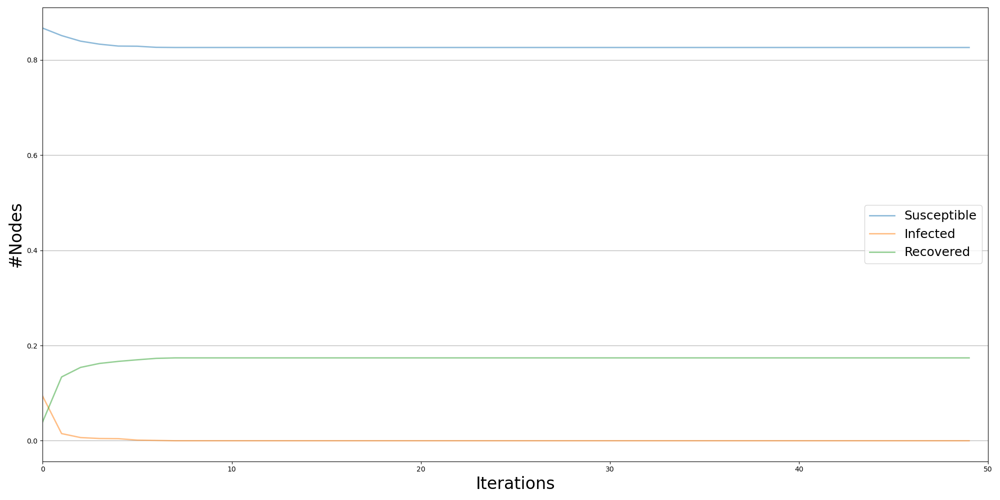

#  Propagation of Fake News: Simulation from Different Nodes of a Graph

### Authors
**Patric Reineri**, **Daniela Magrì**  


---

## Overview

This project focuses on simulating the spread of fake news within a **social network**, particularly on **Twitter**.  
Starting from a single individual (a user who can spread or debunk fake news through tweets or retweets), the simulation analyzes how information propagates through the network.  

The goal is to understand the **dynamics** and **mechanisms** that facilitate the dissemination of fake news, as well as to identify **strategies** for effectively countering it by selecting an optimal set of nodes to initiate the **debunking** process.  

In the simulation, the **fake news diffusion** and **debunking** processes coexist and evolve **in parallel** at each iteration.

---

##  Methodology

### Epidemic Models (SIR/SIS)
The project uses **epidemic diffusion models** (SIR and SIS) to simulate the spread of information.  
Nodes in the network represent users, and their states change based on **probabilistic transitions**:
- **S (Susceptible):** user not yet exposed to fake news.
- **I (Infected):** user who believes or spreads the fake news.
- **R (Recovered):** user who realizes the news is false and helps debunk it.

### Transition Probabilities
Each node’s behavior is determined by a personalized infection probability, based on:
- **Education level (Pi):** lower education → higher infection probability.  
- **Age (Pa):** users under 20 or over 50 are more likely to be “infected.”  
- **Credibility (Pc):** fake news credibility set at 0.7.  

Overall infection probability per node:  
\[
P_{infection}(i) = \frac{P_i + P_a + P_c}{3}
\]

The recovery threshold is defined as:
\[
\text{soglia}_i = P_{infection}(i) - 0.2
\]

---

##  Libraries and Tools

- **[NDlib](https://ndlib.readthedocs.io/en/latest/):** to simulate diffusion dynamics on complex networks.  
- **NetworkX:** to handle and analyze the network structure.  
- **Matplotlib** and **GeoPandas:** for static data visualization.  
- **D3.js:** for dynamic and interactive visualizations.

A custom implementation (`custom_iteration_bunch.py`) was developed to allow node-specific infection probabilities and to simulate simultaneous spreading and debunking at each iteration.

---

##  Datasets

Two networks were used for comparison:

1. **Real Network (Higgs Dataset):**  
   Data from Twitter related to the **discovery of the Higgs boson** (July 1–7, 2012).  
   Each node represents a Twitter user, and edges represent retweets.  
   Source: [Stanford SNAP - Higgs Twitter Dataset](https://snap.stanford.edu/data/higgs-twitter.html)

2. **Artificial Network:**  
   Generated using the **Albert–Barabási** model with the same number of nodes as the real network.

Sampling of **3,000 nodes** was applied to reduce computational complexity.

---

##  Experiments and Results

Five tests were performed using different criteria to select the **initial debunking nodes** (120 nodes in each case):

1. **Test 1:** Highest **degree centrality** nodes  
2. **Test 2:** Highest **betweenness centrality** nodes  
3. **Test 3:** **Random** nodes  
4. **Test 4:** Highest **closeness centrality** nodes  
5. **Test 5:** Highest **eigenvector centrality** nodes  

Each test ran for **50 iterations**.

## Testing Results and Plots




more images are available in the `images` folder.
---

##  Visualization

### Static Visualization
- Implemented with **Matplotlib** and **GeoPandas**.  
- Displays the proportion of nodes in each state (`Infected`, `Recovered`, `Susceptible`) using **choropleth maps**.

### Dynamic Visualization
- Developed with **D3.js**.  
- Interactive network visualization:
  - Color-coded node states.  
  - Hover tooltips showing node attributes.  
  - Buttons for switching between tests.  
  - Zoom and pan features on geographical views.  


## Installation

```bash
git clone https://github.com/PatricReineri/Propagation-of-Fake-News-Simulation-from-Different-Nodes-of-a-Graph.git
cd Propagation-of-Fake-News-Simulation-from-Different-Nodes-of-a-Graph
pip install -r requirements.txt
```

---

##  Usage

Run the simulation and visualize results:

```bash
python simulation_model.py
```

To explore static results:

```bash
jupyter notebook notebooks/data_viz_first_part.ipynb
```


---

##  References

1. Brent Barnhart – *Social Media Demographics for Strategy Development*  
2. Marcella Tambuscio, Giancarlo Ruffo – *Understanding and Countering Misinformation*  
3. Karen M. Douglas et al. – *Understanding Conspiracy Theories*  

